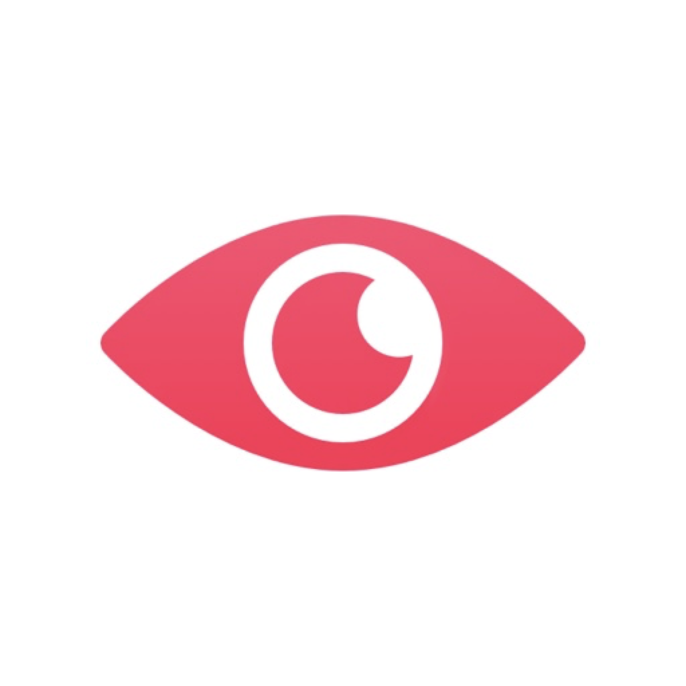
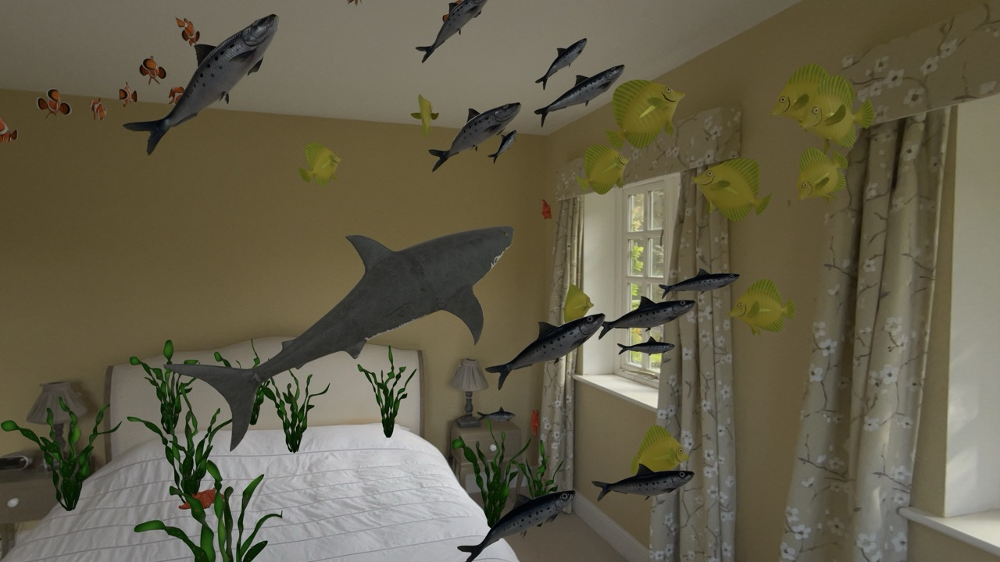

  

# Alive

An interactive AR experience for Apple Vision Pro. Make your living room come alive with realistic creatures that respond to your gestures, movement, and surroundings.

https://jackfinnis.com/apps/alive

## ⚠️ Missing Assets

3D models, audio files, and image assets are not included in this repository due to licensing restrictions. To build and run the app, you'll need these files placed in `Alive/Files/`, `*.rkassets`, and `*.xcassets`. Contact me at [jackfinnis.com](https://jackfinnis.com) if you'd like access.

## 🌍 Spaces

### 🐟 Aquarium
Tap to spawn fish — clownfish, sardines, and yellow tangs school around your room using boid flocking. Reach 50 fish and a shark appears. Seaweed and starfish anchor to your walls and surfaces.

### 🕷️ Cavern
Spiders crawl across your walls and ceiling using pathfinding over spatial mesh surfaces. Hold out your hand and they'll climb onto it. Cobwebs break on contact. Tap to spawn ants.

### 🦋 Meadow
Butterflies flutter through your space. Point to attract them to your finger. Clap to scatter them. Butterfly bushes bloom on your surfaces.

## 🏗️ Architecture

Built with RealityKit's **Entity Component System (ECS)** pattern:

- **Components** — Pure data structs attached to entities (e.g. `FishComponent`, `SpiderComponent`)
- **Systems** — Per-frame logic that queries entities by component (e.g. `FishSystem` runs boid flocking, `SpiderSystem` runs pathfinding)
- **Spaces** — Immersive views that set up entities, providers, and systems

Three ARKit providers feed real-world data into the ECS:
- `HandProvider` — hand joint tracking, gesture detection (pointing, clapping, dropping)
- `DeviceProvider` — headset world position
- `MeshProvider` — spatial mesh anchors for environment understanding

### 🧠 Creature Movement Algorithms

| Creature | Algorithm | Key Behaviors |
|----------|-----------|---------------|
| Fish | Boid flocking — cohesion, separation, alignment, boundary avoidance | Schooling, obstacle avoidance |
| Shark | Seek steering — target selection, obstacle avoidance, scary entity repulsion | Appears at 50+ fish, chases them |
| Spiders | RRT pathfinding — rapidly-exploring random tree over spatial mesh graph | Crawl on walls/ceiling, climb onto hands |
| Butterflies | Waypoint path-following — sequential target pursuit with landing detection | Respond to pointing gestures, scatter on clap |

### ⚡ Performance

- `SpatialGrid` for O(1) spatial neighbor lookups
- Entity recycling: furthest entities removed and respawned closer to the user
- `File` enum caches loaded 3D models to avoid redundant I/O

### 📦 Dependencies

- [Swift Collections](https://github.com/apple/swift-collections) — `HeapModule` for pathfinding
- [TelemetryDeck](https://telemetrydeck.com) — analytics

## 🤝 Contributing

Contributions are welcome! See [TODO.md](TODO.md) for a list of ideas and improvements. Pick one and open a pull request, or create an issue to discuss.

## 🙏 Acknowledgments

### Models

| Asset | Creator | Licence |
|-------|---------|---------|
| [Clownfish](https://developer.apple.com/documentation/realitykit/building_an_immersive_experience_with_realitykit) | [Apple](https://developer.apple.com) | [Apple Sample Code](https://developer.apple.com/support/downloads/terms/apple-sample-code/Apple-Sample-Code-License.pdf) |
| [Sardine](https://developer.apple.com/documentation/realitykit/building_an_immersive_experience_with_realitykit) | [Apple](https://developer.apple.com) | [Apple Sample Code](https://developer.apple.com/support/downloads/terms/apple-sample-code/Apple-Sample-Code-License.pdf) |
| [Yellow Tang](https://developer.apple.com/documentation/realitykit/building_an_immersive_experience_with_realitykit) | [Apple](https://developer.apple.com) | [Apple Sample Code](https://developer.apple.com/support/downloads/terms/apple-sample-code/Apple-Sample-Code-License.pdf) |
| [Starfish](https://developer.apple.com/documentation/realitykit/building_an_immersive_experience_with_realitykit) | [Apple](https://developer.apple.com) | [Apple Sample Code](https://developer.apple.com/support/downloads/terms/apple-sample-code/Apple-Sample-Code-License.pdf) |
| [Seaweed](https://developer.apple.com/documentation/realitykit/building_an_immersive_experience_with_realitykit) | [Apple](https://developer.apple.com) | [Apple Sample Code](https://developer.apple.com/support/downloads/terms/apple-sample-code/Apple-Sample-Code-License.pdf) |
| [Butterfly](https://developer.apple.com/documentation/realitykit/composing-interactive-3d-content-with-realitykit-and-reality-composer-pro) | [Apple](https://developer.apple.com) | [Apple Sample Code](https://developer.apple.com/support/downloads/terms/apple-sample-code/Apple-Sample-Code-License.pdf) |
| [Shark](https://www.turbosquid.com/3d-models/free-shark-3d-model/975376) | [PeterHappyBoy](https://www.turbosquid.com/Search/Artists/PeterHappyBoy) | [TurboSquid](https://www.turbosquid.com/licensing#3d-model-license) |
| [Spider](https://sketchfab.com/3d-models/animated-spider-af87017501fc44e39a33c220f2435100) | [Shadocks](https://sketchfab.com/Shadocks) | [CC BY 4.0](https://creativecommons.org/licenses/by/4.0/) |
| [Ant](https://www.turbosquid.com/3d-models/3d-model-ant-1339233) | [ergin3d](https://www.turbosquid.com/Search/Artists/ergin3d) | [TurboSquid](https://www.turbosquid.com/licensing#3d-model-license) |
| [Butterfly Bush](https://www.fab.com/listings/0b932c4a-706f-4a89-a681-8d6e0deb017c) | [HKhalife](https://www.fab.com/sellers/HKhalife) | [Fab EULA](https://www.fab.com/eula) |

### Images

| Asset | Creator | Licence |
|-------|---------|---------|
| [Eye](https://www.flaticon.com/free-icon/eye_535193) | [Freepik](https://www.flaticon.com/authors/freepik) | [Flaticon](https://www.flaticon.com/legal) |
| [Starfish](https://www.flaticon.com/free-icon/starfish_8715119) | [Design Circle](https://www.flaticon.com/authors/design-circle) | [Flaticon](https://www.flaticon.com/legal) |
| [Cobweb](https://www.flaticon.com/free-icon/spider-web_2250473) | [srip](https://www.flaticon.com/authors/srip) | [Flaticon](https://www.flaticon.com/legal) |
| [Flower](https://www.flaticon.com/free-icon/lily_15019107) | [yoyonpujiono](https://www.flaticon.com/authors/yoyonpujiono) | [Flaticon](https://www.flaticon.com/legal) |

### Audio

| Asset | Creator | Licence |
|-------|---------|---------|
| [Underwater](https://freesound.org/people/wjoojoo/sounds/197751/) | [wjoojoo](https://freesound.org/people/wjoojoo/) | [CC0 1.0](http://creativecommons.org/publicdomain/zero/1.0/) |
| [Cave](https://freesound.org/people/Sclolex/sounds/177958/) | [Sclolex](https://freesound.org/people/Sclolex/) | [CC0 1.0](http://creativecommons.org/publicdomain/zero/1.0/) |
| [Forest](https://freesound.org/people/Erablo42/sounds/661187/) | [Erablo42](https://freesound.org/people/Erablo42/) | [CC BY 4.0](https://creativecommons.org/licenses/by/4.0/) |
